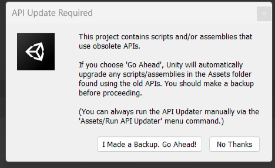
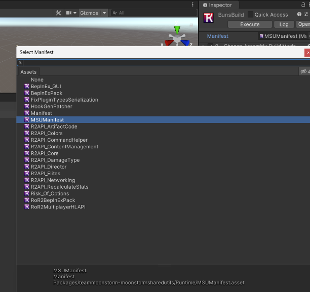

# Onboarding

1. Create a new blank unity 3D project using the 2021.3.33.f1 version

2. Install the latest versions of the following github packages, using the UnityPackageManager:

- [ThunderKit](https://github.com/PassivePicasso/ThunderKit) version 9.0.0 or Greater
- [RoR2ImportExtensions](https://github.com/risk-of-thunder/RoR2ImportExtensions) version 1.7.0 or Greater
- [RoR2EditorKit](https://github.com/risk-of-thunder/RoR2EditorKit) version 5.2.1 or Greater
- [RoR2UnityMultiplayerHLAPI](https://github.com/risk-of-thunder/UnityMultiplayerHLAPI) version 1.1.1 or Greater

    -  It is important that you use the versioned versions instead of the pre-release or indev versions. To select the correct version, You can click the big green “<> Code” button, and then copy the https url. You can append an “#” followed by your desired version to specify what version to download.
    - 

3. After installing the 4 packages, close your project, this will ensure stability later on.

4. Clone the MSU repository into your project's packages/ folder, name the cloned repository's parent folder `teammoonstorm-moonstormsharedutils` (this will ensure certain editor utilities work correctly.) 

5. Once the cloning process is complete, Open the project

6. Copy `SerializedR2APISubmoduleDependencies.json` from `teammoonstorm-moonstormsharedutils/Editor/ThunderKitSupport` and paste it into `Assets/ThunderkitSettings`

7. Open the thunderkit settings window, and select the import config. you'll want to do the following:
- Disable “WWise Blacklister”
- On “Import Project Settings”, select “Everything”
- On the “R2API Submodule Installer”, hit the “Disable All” button
- Disable “Install RoR2 Editor Kit”
- Disable "Install RoR2MultiplayerHLAPI"

8. After configuring your import process, click the “ThunderKit Settings” on the sidebar

9. Add the exe path and hit Import (Unity might ask you to restart the project twice and this process could take awhile)

10. If during the import process, the editor stops responding and doesnt continue importing, close the project, and delete any folders in the packages folder (Except for the moonstorm shared utils one) Then reopen the project and reimport

    - ⚠️: If you ever see this image or similar, ALWAYS hit “No Thanks” or you WILL break things....
    - 

11. Copy `MoonstormSharedUtils/Editor/Assets/ThunderKit/Pipelines/Contributor/GenericContributor` to your `Assets` folder and configure the pipeline similar to [Starstorm 2's Build Config](https://github.com/TeamMoonstorm/Starstorm2#issues-qa)

12. You should now be able to build!
Make sure: 
    - 
    - That MSUManifest is selected in the build task and that the pipeline job has the correct path here so it knows to output in the plugins folder/
